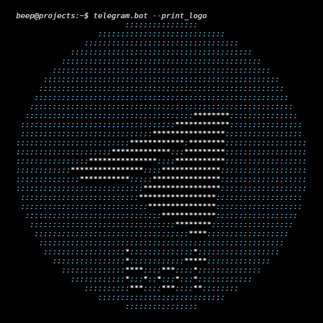
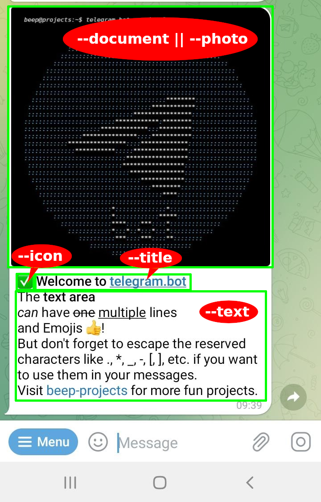

# telegram.bot   
[](https://github.com/beep-projects/telegram.bot/blob/main/LICENSE) [](https://github.com/beep-projects/telegram.bot/actions/workflows/shellcheck.yml) [](https://github.com/beep-projects/telegram.bot/network) [](https://github.com/beep-projects/telegram.bot/stargazers)   

[](https://github.com/beep-projects/telegram.bot/) [](https://github.com/beep-projects/telegram.bot/) [](https://github.com/beep-projects/telegram.bot/) [](https://github.com/beep-projects/telegram.bot/) [](https://github.com/beep-projects/telegram.bot/) 


`telegram.bot` is a bash script to send Telegram messages on [Debian](https://www.debian.org/)-based distributions.

Goal is to have the installation foot print as low as possible, but it still dependes on [curl](https://curl.se/) and [jq](https://stedolan.github.io/jq/).

This script is based on https://github.com/NicolasBernaerts/debian-scripts/tree/master/telegram 


# Contents

- [Usage](#usage)
- [Install/Update](#installupdate)
- [Uninstall](#uninstall)
- [Commands](#commands)
  - [Get Help](#get-help)
  - [Test API Token](#test-api-token)
  - [Get Chatid](#get-chatid)
  - [Get Updates](#get-updates)
  - [Get Update Offset](#get-update-offset)
  - [Set Commands](#set-commands)
  - [Delete Commands](#delete-commands)
  - [Send Text](#send-text)
  - [Pipe Text to send](#pipe-text-to-send)
  - [Send Text from a File](#send-text-from-a-file)
  - [Send a Photo](#send-a-photo)
  - [Send a Document](#send-a-document)
  - [Optional Flags](#optional-flags)
  - [Flags Compatibility Matrix](#flags-compatibility-matrix)


## Usage

[(Back to Contents)](#contents)

For using `telegram.bot`, you need a **Telegram** account and app. See [telegram.org](https://telegram.org/) on how to set this up.  Once you have Telegram installed, you need to create a **bot** and get an **API token** for it. This can be done by talking to **[@BotFather](https://core.telegram.org/bots#6-botfather)** in your Telegram app. [Follow this guide](https://core.telegram.org/bots#6-botfather), or google for it.

The **API token** is a string like `110201543:AAHdqTcvCH1vGWJxfSeofSAs0K5PALDsaw` that is required to authorize your requests for communication via the Bot API.  Once you have obtained an API token to authorize your bot, you can start using `telegram.bot`.

First thing you should do is to test if your API token is valid. The test will finish silently, if the API token is valid, and it will return the Telegram server's reply, if the API token is invalid, e.g.

```bash
beep@projects:~$ telegram.bot --test_token 110201543:AAHdqTcvCH1vGWJxfSeofSAs0K5PALDsaw
{"ok":false,"error_code":404,"description":"Not Found"}
beep@projects:~$ 
```

Once you have an API token for your bot, you need a **chat id** to which the bot should talk to. The chat id is not easy to find, but `telegram.bot` will help you.

You have two options:

- You either make the bot to chat with you directly, then you need your personal chat id.
- Or you make the bot to chat with a group, then you have to add the bot first to that group. 

<sub>(One note about bots in groups: By default, bots can only read **commands** which are posted in groups and not all messages. A command is a single words (`[a-z_0-9]{1,32}`) with a prefixed `/`, e.g. `/help`. If you want that your bot can receive all messages from a group, you have to promote it to be a group admin. )</sub>

What ever your choice is, send a message to the group, or to your bot and call the following command. This will give you a list of chat ids, from which the bot got updates.

```bash
beep@projects:~$ telegram.bot --get_chatid --bottoken 110201543:AAHdqTcvCH1vGWJxfSeofSAs0K5PALDsaw
[
  {
    "chatid": -1337818101234,
    "name": "condocam.ai"
  },
  {
    "chatid": -575749100,
    "name": "SystaPi"
  },
  {
    "chatid": 8339234211,
    "name": "Beep"
  }
]
```

With that information, you are ready to go!

```bash
beep@projects:~$ telegram.bot --chatid 8339234211 --bottoken 110201543:AAHdqTcvCH1vGWJxfSeofSAs0K5PALDsaw --text "Hello World"
```

Messages are build up by four elements (`--document` || `--photo`), `--icon`, `--title` and `--text`  which can be used stand alone, or in combination.

```bash
beep@projects:~/git/telegram.bot$ ./telegram.bot --bottoken 110201543:AAHdqTcvCH1vGWJxfSeofSAs0K5PALDsaw --chatid 8339234211 --photo resources/telegram.bot.logo.png --success --title "Welcome to telegram\.bot" --text "The *text area*\n_can_ have ~one~ __multiple__ lines\nand Emojis \U1f44d\!\nBut don't forget to escape the reserved characters like \., \*, \_, \-, \[, \], etc\. if you want to use them in your messages\.\nVisit [beep\-projects](https://github.com/beep\-projects/) for more fun projects\."
```
<p align="center">



</p> 

## Install/Update

[(Back to Contents)](#contents)

The script has build in functionality to copy itself to `/usr/local/bin`, which should be in the path of most Linux distributions. It also resolves its dependencies on `curl` and `jq` via apt, which binds it to Debian-based distributions. For updating the script, you can run the same routine as for installation, or just copy the new version of the script on your own to `/usr/local/bin`.

```bash
wget https://github.com/beep-projects/telegram.bot/telegram.bot
chmod 755 telegram.bot
sudo ./telegram.bot --install
```

## 

## Uninstall

[(Back to Contents)](#contents)

To uninstall the script, you just have to remove it from `/usr/local/bin`. 
You have to decide if you also want to remove `curl` and `jq` and remove these packages on your own.

```bash
sudo rm /usr/local/bin/telegram.bot
sudo apt purge jq curl
```


## Commands

[(Back to Contents)](#contents)

The script makes use of the official [Telegram Bot API](https://core.telegram.org/bots/api). Please check the API for commands that you would like to get added to `telegram.bot` and start a [new discussion](https://github.com/beep-projects/telegram.bot/discussions/new) for it.

### Get Help

[(Back to Commands)](#commands)

Displays the help text on command usage

```bash
beep@projects:~$ telegram.bot --help
  telegram.bot: Tool to send a message to a Telegram User or Channel.
  Message is sent from a Telegram Bot and can contain icon, text, image and/or document.
  Main parameters are :
    -h/-?/--help           display this help and exit
    --install              install dependencies, copy telegram.bot to /usr/local/bin and exit (run as root)
    --print_logo           print the telegram.bot logo
    --get_chatid           calls getUpdates on the --bottoken and returns the chat ids found
                           This call will stop after --timeout seconds (or 60 seconds if not specified) if no update is received 
    --get_updates          gets the updates available for --bottoken. Can be restricted to only get updates >= --offset
    --get_update_offset    gets the offset of the last update available for --bottoken
    -test/--test_token     Test if the provided --bottoken is valid
    -del/--delete_commands Delete all commands for the bot identified by --bottoken
    -set/--set_commands "command1=description1" "command2=description2" ... Set the commands for this bot
    -t/--text <text>       Text of the message (use - for piped text)
    -f/--file <file>       File holding the text of the message
    -p/--photo <file>      Image to display
    -d/--document <file>   Document to transfer
  Options are :
    --title <title>        Title of the message
    --html                 Use HTML mode for text content (markdown by default)
    --disable_preview      Don't create previews for links, image and/or document
    --protected            Protects the contents of the sent message from forwarding and saving
    --silent               Send message in silent mode (no user notification on the client)
    -q/--quiet             Don't print message to stdout
    -v/--verbose           explain what is being done
    --timeout <timeout>    used by --get_chatid to timeout after <timeout> seconds. Overwrites the default value 60          
    -cid/--chatid <chat-id>    Recipient User or Channel ID
    -bt|-token|--bottoken <bot-token>     Bot Token of your Telegram bot
  Optional icons are :
    --success              Add a success icon
    --warning              Add a warning icon
    --error                Add an error icon
    --question             Add a question mark icon
    --icon <code>          Add an icon by UTF-8 code (ex \U1F355)
  Here is an example of piped text :
    echo 'text to be displayed' | telegram.bot --success --text -

```

This command requires the following flags `--help` 

### Test API Token

[(Back to Commands)](#commands) [(Bot API getMe)](https://core.telegram.org/bots/api#getme)

Calls [getMe](https://core.telegram.org/bots/api#getme) funtion of the Bot API and checks the returned JSON. 

If the result is ok, nothing is returned

If the result is not ok, the reply from the server is returned

```bash
beep@projects:~$ telegram.bot --test_token 110201543:AAHdqTcvCH1vGWJxfSeofSAs0K5PALDsaw
{"ok":false,"error_code":404,"description":"Not Found"}
beep@projects:~$ 
```

This command requires the following flags `--test_token` 

### Get Chatid

[(Back to Commands)](#commands) ([Bot API getUpdates](https://core.telegram.org/bots/api#getupdates))

`--get_chatid` uses the [getUpdates](https://core.telegram.org/bots/api#getupdates) function to retrieve all available updates from all chats that this bot is added to. The result of this call depends on the available updates and will not reliably find all chats that this bot is added to. Incoming updates are stored on the server until the bot receives them, but they will not be kept longer than 24 hours. So you will not find chats that have been quiet for the last 24h.

If no update is available, the bot will keep polling the server for updates. By default, this is done for 60 seconds. You can change this duration by passing a different value using the `--timeout` flag.

If you want to get only the chat id of the last update, you can use `--get_update_offset` and pass the received offset value to `--get_chatid` via the `--offset` option.

```bash
beep@projects:~$ telegram.bot --get_chatid --bottoken 110201543:AAHdqTcvCH1vGWJxfSeofSAs0K5PALDsaw
[
  {
    "chatid": -1337818101234,
    "name": "condocam.ai"
  },
  {
    "chatid": -575749100,
    "name": "SystaPi"
  },
  {
    "chatid": 8339234211,
    "name": "Beep"
  }
]
```

This command requires the following flags `--bottoken`, `--get_chatid` 

### Get Updates

[(Back to Commands)](#commands) [(Bot API getUpdates)](https://core.telegram.org/bots/api#getupdates)

Calls the [getUpdates](https://core.telegram.org/bots/api#getupdates) function from the bot API and returns the received JSON. This is the function that you need to call for implementing your own Telegram bot and you need to understand how to parse the returned [Update](https://core.telegram.org/bots/api#update) objects. 

In order to avoid getting duplicate updates, extract the **offset** field after each server response. If you missed that, you can call [`--get_update_offset`](#get_update_offset) to get the offset of the latest update.

```bash
beep@projects:~$ telegram.bot --get_updates --bottoken 110201543:AAHdqTcvCH1vGWJxfSeofSAs0K5PALDsaw
{"ok":true,"result":[{"update_id":977635326,
"my_chat_member":{"chat":{"id":-1001818113370,"title":"A group for my bot","type":"supergroup"},"from":{"id":8339234211,"is_bot":false,"first_name":"Beep","language_code":"en"},"date":1664721399,"old_chat_member":{"user":{"id":110201543,"is_bot":true,"first_name":"bot","username":"telegram.bot"},"status":"member"},"new_chat_member":{"user":{"id":110201543,"is_bot":true,"first_name":"bot","username":"telegram.bot"},"status":"administrator","can_be_edited":false,"can_manage_chat":true,"can_change_info":true,"can_delete_messages":true,"can_invite_users":true,"can_restrict_members":true,"can_pin_messages":true,"can_promote_members":false,"can_manage_video_chats":true,"is_anonymous":false,"can_manage_voice_chats":true}}},{"update_id":977635327,
"message":{"message_id":1075,"from":{"id":8339234211,"is_bot":false,"first_name":"Beep","language_code":"en"},"chat":{"id":8339234211,"first_name":"Beep","type":"private"},"date":1664721421,"text":"Hey bot, did you see the messages in the chat group?"}},{"update_id":977635328,
"message":{"message_id":12,"from":{"id":8339234211,"is_bot":false,"first_name":"Beep","language_code":"en"},"chat":{"id":-1001818113370,"title":"A group for my bot","type":"supergroup"},"date":1664717944,"text":"Glad that the bot cannot read normal messages in this group"}},{"update_id":977635329,
"message":{"message_id":13,"from":{"id":8339234211,"is_bot":false,"first_name":"Beep","language_code":"en"},"chat":{"id":-1001818113370,"title":"A group for my bot","type":"supergroup"},"date":1664721318,"text":"Let's make the bot a group admin"}},{"update_id":977635330,
"message":{"message_id":14,"from":{"id":8339234211,"is_bot":false,"first_name":"Beep","language_code":"en"},"chat":{"id":-1001818113370,"title":"A group for my bot","type":"supergroup"},"date":1664721428,"text":"Dang, once the bot is admin, it receives all the messages from the last 24h"}}]}

```

This command requires the following flags `--bottoken`, `--get_updates`

### Get Update Offset

[(Back to Commands)](#commands)

Calls the [getUpdates](https://core.telegram.org/bots/api#getupdates) function from the bot API and returns and extracts the **offset** value for the last received Update. In order to avoid getting duplicate updates, you should pass `offset+1` to [`--get_updates`](#get_updates) using the `--offset` flag

```bash
beep@projects:~$ telegram.bot --get_update_offset --bottoken 110201543:AAHdqTcvCH1vGWJxfSeofSAs0K5PALDsaw
977635330
```

This command requires the following flags `--bottoken`, `--get_update_offset` 

### Set Commands

[(Back to Commands)](#commands) [(Bot API setMyCommands)](https://core.telegram.org/bots/api#setmycommands)

Use this method to change the list of the bot's commands. It calls [setMyCommands](https://core.telegram.org/bots/api#setmycommands) of the bot API.

It requires `--bottoken`  to identify the bot, for which the commands should be set and a list of "\<command>=\<description>" separated by spaces. 

```bash
beep@projects:~$ telegram.bot --bottoken 110201543:AAHdqTcvCH1vGWJxfSeofSAs0K5PALDsaw --set_commands "help=show commands list" "reboot=reboot bot server" "shutdown=shut down bot server" "restartme=restart motioneye.service" "status=get system status" "snapshot=get snapshots from all cameras" "uptime=call uptime" "df=call df -h" "mdon=enable motion detection" "mdoff=disable motion detection" "setcommands=update commands at @BotFather"
```

This command requires the following flags `--bottoken`, `--set_commands` 

### Delete Commands

[(Back to Commands)](#commands) [(Bot API deleteMyCommands)](https://core.telegram.org/bots/api#deletemycommands)

Use this method to delete the list of the bot's commands. This function simply calls [deleteMyCommands](https://core.telegram.org/bots/api#deletemycommands) of the bot API.

```bash
beep@projects:~$ telegram.bot --delete_commands --bottoken 110201543:AAHdqTcvCH1vGWJxfSeofSAs0K5PALDsaw
```

This command requires the following flags `--bottoken`, `--delete_commands` 

### Send Text

[(Back to Commands)](#commands) [(Bot API sendMessage)](https://core.telegram.org/bots/api#sendmessage)

Use this method to send text messages.

```bash
beep@projects:~$ telegram.bot --bottoken 110201543:AAHdqTcvCH1vGWJxfSeofSAs0K5PALDsaw --chatid 8339234211 --text "Hello World"
```

This command requires the following flags `--bottoken`, `--chatid`, `--text` 

Optional you can add an `--icon` to the beginning of your message . For easier use, `--success` (:white_check_mark:, \U2705), `--warning` (:warning:, \U26A0), `--error` (:rotating_light:, \U1F6A8), and `--question` (:question:, \U2753)  are, predefined icons. You can find other codes to use in the [Emoji List](https://unicode.org/emoji/charts/full-emoji-list.html) (Telegram does not support the full list, but unfortunately I have not yet found a complete list for Telegram)

Another option is to add a`--title`, which actually puts a new line holding the title in bold to the beginning of the message, just afer the icon, if set.

### Pipe Text to send

[(Back to Commands)](#commands) [(send text)](#send-text)

A special case to send text is piping (`|`) the text to `telegram.bot`, e.g. the output of a command. This can be done by using `-` as single argument to `--text -`.

```bash
beep@projects:~$ echo 'Hello World' | telegram.bot --bottoken 110201543:AAHdqTcvCH1vGWJxfSeofSAs0K5PALDsaw --chatid 8339234211 --text -
```

This command requires the following flags `--bottoken`, `--chatid`, `--text` 

You can use all other flags that you can also use with [--text](#send-text).

### Send Text from a File

[(Back to Commands)](#commands) [(send text)](#send-text)

This function reads the content from a text file and sends it

```bash
beep@projects:~$ telegram.bot --chatid 8339234211 --bottoken 110201543:AAHdqTcvCH1vGWJxfSeofSAs0K5PALDsaw --file resources/testtextfile.txt
```

This command requires the following flags `--bottoken`, `--chatid`, `--file` 

Text passed via `--text` will be overwritten with the content of the text file.

You can use all other flags that you can also use with [--text](#send-text).

### Send a Photo

[(Back to Commands)](#commands) [(Bot API sendPhoto)](https://core.telegram.org/bots/api#sendphoto)	

Use this method to send photos.

```bash
beep@projects:~/git/telegram.bot$ ./telegram.bot --bottoken 110201543:AAHdqTcvCH1vGWJxfSeofSAs0K5PALDsaw --chatid 8339234211 --photo resources/telegram.bot.logo.png --success --title "Welcome to telegram\.bot" --text "The *text area*\n_can_ have ~one~ __multiple__ lines\nand Emojis \U1f44d\!\nBut don't forget to escape the reserved characters like \., \*, \_, \-, \[, \], etc\. if you want to use them in your messages\.\nVisit [beep\-projects](https://github.com/beep\-projects/) for more fun projects\."
```

This command requires the following flags `--bottoken`, `--chatid`, `--photo`

Optionally, you can add `--icon`. `--title`, and `--text` to the message

#### Send a Document

[(Back to Commands)](#commands) [(Bot API sendDocument)](https://core.telegram.org/bots/api#senddocument)

Use this method to send general files. Bots can currently send files of any type of up to 50 MB in size, this limit may be changed in the future.

```bash
beep@projects:~/git/telegram.bot$ ./telegram.bot --bottoken 110201543:AAHdqTcvCH1vGWJxfSeofSAs0K5PALDsaw --chatid 8339234211 --document resources/telegram.bot.logo.png --success --title "Welcome to telegram\.bot" --text "The *text area*\n_can_ have ~one~ __multiple__ lines\nand Emojis \U1f44d\!\nBut don't forget to escape the reserved characters like \., \*, \_, \-, \[, \], etc\. if you want to use them in your messages\.\nVisit [beep\-projects](https://github.com/beep\-projects/) for more fun projects\."
```

This command requires the following flags `--bottoken`, `--chatid`, `--document`

Optionally, you can add `--icon`. `--title`, and `--text` to the message

#### Optional flags

`--html` Default formatting of `--text` is [MarkdownV2 style](https://core.telegram.org/bots/api#markdownv2-style) but you can change it to [HTML style](https://core.telegram.org/bots/api#html-style) by setting the `--html` flag

`--disable_preview` Disables link previews for links in this message

`--silent` Sends the message [silently](https://telegram.org/blog/channels-2-0#silent-messages). Users will receive a notification with no sound.

`--protected`  Protects the contents of the sent message from forwarding and saving

`--quiet` suppresses error messages and takes care that `telegram.bot` is not returning any status information.

`--verbose` tells the script to print out additional information on what is going on

### Flags Compatibility Matrix

**r** = required

o = optional

| arguments:arrow_right:<br />:arrow_down: commands            | `--bottoken` | `--chatid` | `--disable_preview` | `--html` | `--icon` `--error` `--success` `--question` `--warning` | `--offset` | `--quiet` | `--silent` | `--protected` | `--text` | `--timeout` | `--title` | `--verbose` |
| ------------------------------------------------------------ | :----------: | :--------: | :-----------------: | :------: | :-----------------------------------------------------: | :--------: | :-------: | :--------: | :-----------: | :------: | :---------: | :-------: | :---------: |
| **`--delete_commands`**                                      |    **r**     |            |                     |          |                                                         |            |     o     |            |               |          |             |           |      o      |
| **`--document`**                                             |    **r**     |   **r**    |                     |    o     |                            o                            |            |     o     |     o      |       o       |    o     |             |     o     |      o      |
| **`--install`**                                              |              |            |                     |          |                                                         |            |     o     |            |               |          |             |           |      o      |
| **`--file`**                                                 |    **r**     |   **r**    |          o          |    o     |                            o                            |            |     o     |     o      |       o       |          |             |     o     |      o      |
| **`--get_chatid`**                                           |    **r**     |            |                     |          |                                                         |     o      |     o     |            |               |          |      o      |           |      o      |
| **`--get_update_offset`**                                    |    **r**     |            |                     |          |                                                         |            |     o     |            |               |          |             |           |      o      |
| **`--get_updates`**                                          |    **r**     |            |                     |          |                                                         |     o      |     o     |            |               |          |             |           |      o      |
| **`--help`**                                                 |              |            |                     |          |                                                         |            |     o     |            |               |          |             |           |      o      |
| **`--print_logo`**                                           |              |            |                     |          |                                                         |            |     o     |            |               |          |             |           |      o      |
| **`--photo`**                                                |    **r**     |   **r**    |                     |    o     |                            o                            |            |     o     |     o      |       o       |    o     |             |     o     |      o      |
| **`--set_commands`**                                         |    **r**     |            |                     |          |                                                         |            |     o     |            |               |          |             |           |      o      |
| **`--icon`** **`--error`** **`--success`** **`--question`** **`--warning`** |    **r**     |   **r**    |                     |    o     |                                                         |            |     o     |     o      |       o       |    o     |             |     o     |      o      |
| **`--test_token`**                                           |    **r**     |            |                     |          |                                                         |            |     o     |            |               |          |             |           |      o      |
| **`--text`**                                                 |    **r**     |   **r**    |          o          |    o     |                            o                            |            |     o     |     o      |       o       |          |             |     o     |      o      |
| **`--title`**                                                |    **r**     |   **r**    |                     |    o     |                            o                            |            |     o     |     o      |       o       |    o     |             |           |      o      |

